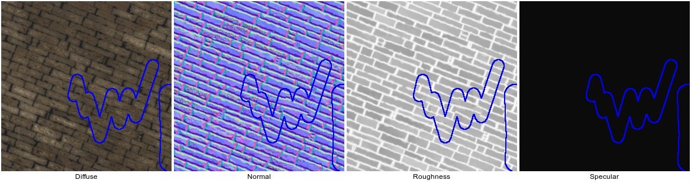

# Patch-based Material Inpainting

This repository is a modification of the code of Alasdair Newson, Andrés Almansa, Yann Gousseau, and Patrick Pérez, Non-Local Patch-Based Image Inpainting, Image Processing On Line, 7 (2017), pp. 373–385. https://doi.org/10.5201/ipol.2017.189

The code is modified to perform the inpainting of materials using the following maps:
- diffuse color
- normal map
- roughness
- specular



## Usage

Build with `make` and then use with:
```
./bin/inpaint_image folderIn folderOut
```

The code makes a lot of assumptions about the structure of the folders and the name of the files. Instead of pointing to a single file, you should provide the path of a folder `folderIn` which contains the following files:
- `diffuse.png`
- `normal.png`
- `roughness.png`
- `specular.png`
- `mask.png`

The outputs will be saved in a new folder `folderOut`.

This code is a naive extension of the algorithm of Newson et al. and has the following limitations:
- the channels are not normalized which can lead to some channels being more important than others in the distance
- the features (gradients) are disabled (but should be computed for the diffuse color)
- the normals may have a norm != 1
- the image reading library has difficulties with formats using something different than 8 bit RGB
